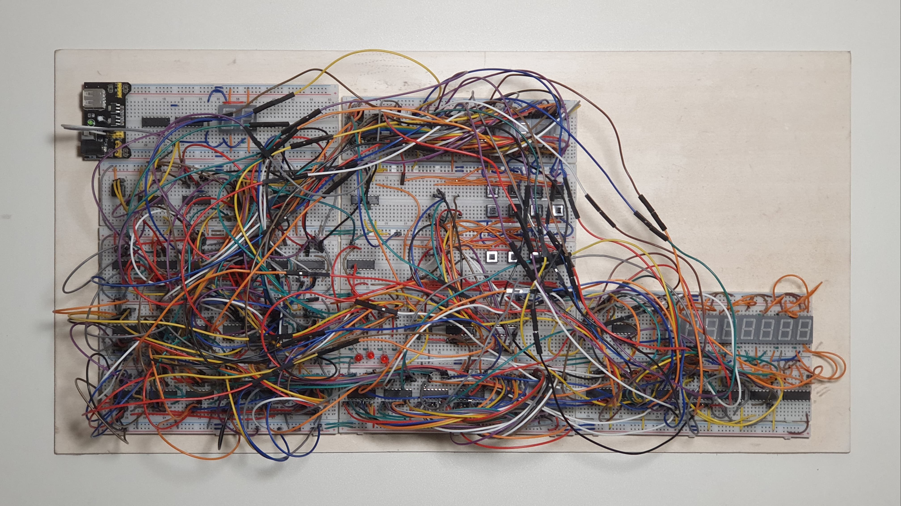
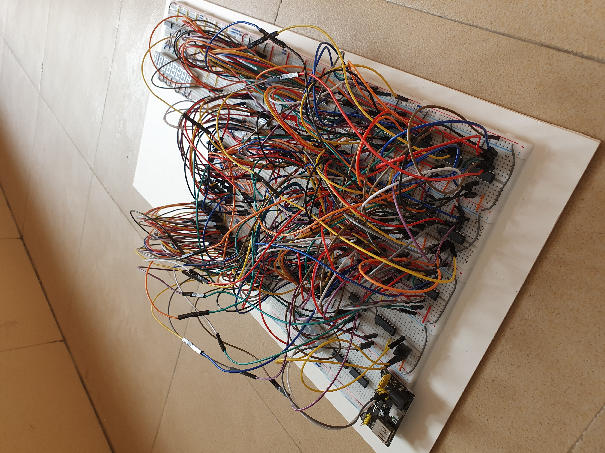
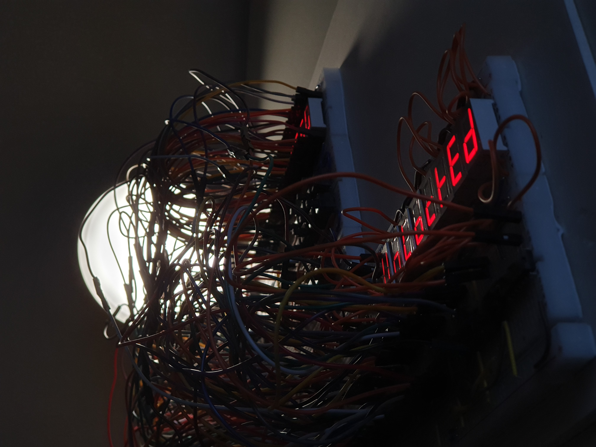
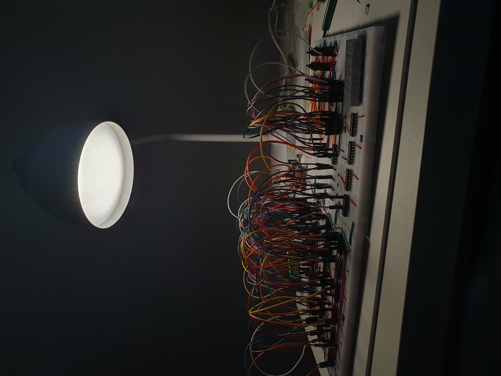
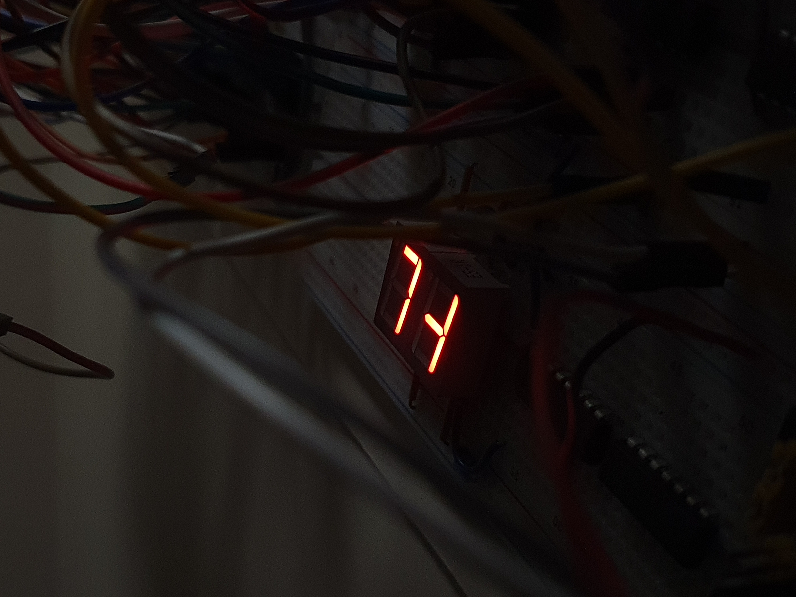

# **Barebones Digital Lock**  
A passcode-protected digital lock built entirely using basic logic circuits—no microcontrollers involved!  

## **Project Overview**

The **Barebones Digital Lock** is a simple yet effective demonstration of how a secure passcode system can be implemented using combinational and sequential digital logic. This project showcases the power of flip-flops, logic gates, and counters to create a fully functional lock system, emphasizing simplicity and resourcefulness by avoiding microcontrollers or advanced processing units.

This project was developed as part of the **CSE231 - Digital Logic Design** course at **North South University** during the **Summer 2024 Semester**. The course was instructed by **Dr. Khaleda Akter**, who encouraged projects that were not overly simplistic and avoided microcontroller usage. The system was independently designed and implemented by the team members.

## **Key Features**

- **4-Digit Passcode Security**: Securely stores a 4-digit passcode, with each digit ranging from 0–9 and extended inputs A, B, C, and D.  
- **Control Characters**: The `*` key is used to reset the passcode, while the `#` key switches between authentication and registration modes.  
- **Conditional Access**: Switching to registration mode is only allowed if the stored authentication and registration passcodes match, ensuring security. However, switching back to authentication mode is always possible.  
- **Minimal Components**: Designed using only basic components like flip-flops, logic gates, and encoders.  
- **Efficient Design**: Combines combinational and sequential circuits for streamlined operation.  

## **How It Works**

1. **Keypad Input**: A matrix keypad is used to enter digits of the passcode, allowing inputs 0–9 and A–D.  
2. **Control Characters**:  
   - The `*` key resets the passcode.  
   - The `#` key toggles between authentication and registration modes.  
3. **Encoder**: Converts each keypress into a unique binary value.  
4. **Sequential Storage**: Flip-flops store the passcode digits sequentially, controlled by a counter and logic gates.  
5. **Mode Control Logic**:  
   - Switching to registration mode (`*`) is blocked if the stored digits in the authentication and registration flip-flops do not match, preventing unauthorized access.  
   - Switching to authentication mode (`#`) is always permitted.  
6. **Validation Logic**: Logic circuits compare the entered code with the stored passcode in authentication mode to grant or deny access.  

## **Implementation Challenges**

### **Keypad Limitation**  
During the implementation, the team initially purchased a 4x4 matrix keypad for input purposes. However, it was discovered that using this keypad required an Arduino or similar microcontroller, which was not permitted for this project. To overcome this limitation, the team innovatively created a custom keypad using individual switches, ensuring compliance with the project’s constraints while maintaining full functionality.

### **Clock Signal Instability**  
Giving the clock signal using a physical switch introduced unpredictability. This caused the counters used to control the cursor positions for the authentication and registration modes to behave erratically. The system would sometimes fail to register inputs, or worse, cause three digits to change to the same value at once, disrupting the passcode functionality.  
To resolve this issue at the hardware level, a **555 timer** in monostable mode was used alongside a **capacitor** to stabilize the clock signal. This ensured that the counters received consistent and predictable pulses, eliminating the erratic behavior and improving overall reliability.

## **Why "Barebones"?**  
The name **"Barebones"** reflects the simplicity and fundamental nature of this project. It was designed to demonstrate the core principles of digital logic design using basic, easily available components—without relying on microcontrollers, advanced processors, or complex systems. By utilizing flip-flops, logic gates, and counters, this project showcases how secure systems can be built from the ground up using only the essential building blocks of digital electronics. The aim was to create a fully functional system with minimal resources, ensuring that the project was accessible and easy to understand for those learning the fundamentals of digital circuits.

## **How to Simulate in Logisim**

1. **Download Logisim**: The Logisim executable file can be found [here](simulation/LogiSim/LogiSim.exe).  
2. **Load the Project**: Open Logisim and navigate to the circuit file provided in the repository.  
3. **Install 7-Segment Display Driver**: The required driver for the 7-segment display can be found [here](https://github.com/marceloboeira/logisim-7-segment-display-driver). Download and install it in LogiSim.  
4. **Run the Simulation**: Use Logisim to interact with the keypad and observe the lock system in action.  

## **Component List**

| #  | Component                             | Quantity |
|----|---------------------------------------|----------|
| 1  | 9V Battery                            | 1        |
| 2  | Breadboard                            | 12       |
| 3  | Common Anode 7-segment display        | 10       |
| 4  | Common Cathode 7-segment display      | 8        |
| 5  | IC 7404 Hex Inverter                  | 2        |
| 6  | IC 7408 Quadruple 2-input AND gates   | 5        |
| 7  | IC 74148 8:3 Priority Encoder         | 2        |
| 8  | IC 7432 Quadruple 2-input OR gates    | 6        |
| 9  | IC 7447 Common Anode BCD Decoder      | 8        |
| 10 | IC 7473 Dual JK Flip-flops            | 2        |
| 11 | IC 7474 Dual D Flip-flops             | 16       |
| 12 | IC 7486 Quadruple 2-input XOR gates   | 4        |
| 13 | Push Switch                           | 16       |
| 14 | Set of Jumper Wires (40pcs)           | 5        |
| 15 | Wire Box                              | 3        |

## **Screenshots & Photos**
Here are some visuals of the Barebones Digital Lock system in action.

### **Simulation Screenshots**
  
*The complete circuit layout in Logisim.*

### **Real-Life Circuit Implementation**
  
*A comeplete top-down view of the circuit after completion.*

  
*Our actual breadboard circuit in action.*

  
*A close up shot of the circuit display when the passwords match.*

*At this stage, the circuit is still incomplete—wiring is in progress, and components are being tested before final assembly.*

*A creative 7-segment display graphic forming the abbreviation "TL" to represent our team name.*  

## **Team**  
This project was collaboratively developed by:  
- [Liana Shams](https://github.com/lianashams)  
- [Abdullah Salim](https://github.com/abdullxhsalim)  
- [Mohammad Yasir](https://www.linkedin.com/in/md-yasir-xt/)  
- [Afsana Umme Kulsum Eaty](https://www.facebook.com/eaty.afsana.3) 

Check out our project on LinkedIn: [Barebones Digital Lock](https://lnkd.in/gsgk5_EE)  

## **License**  
This project is licensed under the [MIT License](LICENSE).
